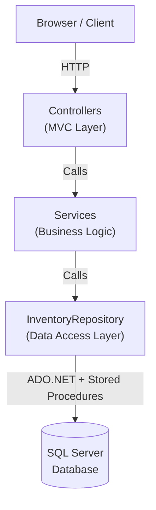
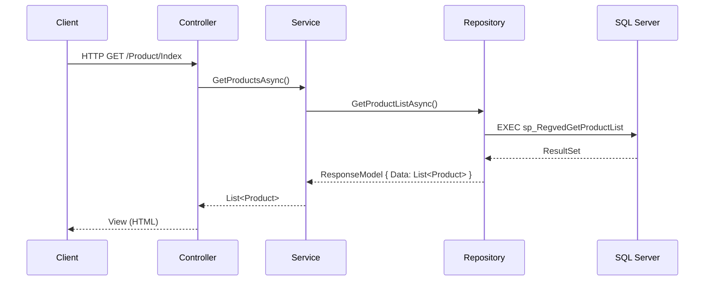
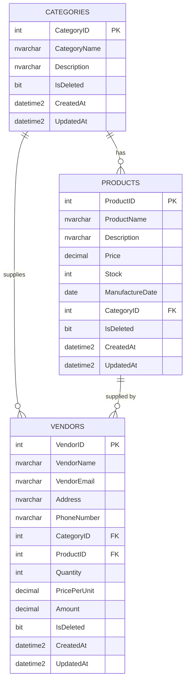

# Regved Inventory Management System

<div align="center">


A production-grade, enterprise-ready Inventory Management System built with **ASP.NET Core 8 MVC**, **ADO.NET**, and **Microsoft SQL Server**. Features a modern Bootstrap 5 dashboard, full CRUD operations, soft-delete with Recycle Bin, real-time low-stock alerts, and a comprehensive xUnit test suite.

</div>

---

## Table of Contents

- [Features](#features)
- [Architecture](#architecture)
- [Tech Stack](#tech-stack)
- [Database Schema](#database-schema)
- [Getting Started](#getting-started)
- [Configuration](#configuration)
- [Project Structure](#project-structure)
- [API / Endpoints](#api--endpoints)
- [Testing](#testing)
- [Contributing](#contributing)
- [License](#license)

---

## Features

| Feature | Status |
|---------|--------|
| Product CRUD (Create, Read, Update, Delete) | ✅ |
| Category CRUD | ✅ |
| Vendor / Supplier CRUD | ✅ |
| Soft Delete with Recycle Bin | ✅ |
| Restore & Permanent Delete from Recycle Bin | ✅ |
| Dashboard with KPI Cards | ✅ |
| Low-Stock Alerts (configurable threshold) | ✅ |
| Total Inventory Value Calculation | ✅ |
| DataTables (search, sort, pagination) | ✅ |
| Server-side Validation & Antiforgery | ✅ |
| Structured Logging (ILogger) | ✅ |
| Health Check Endpoint | ✅ |
| SQL Setup Scripts (schema + seed data) | ✅ |
| xUnit + Moq Test Suite | ✅ |
| Responsive Bootstrap 5 UI | ✅ |

---

## Architecture

The application follows a clean **layered architecture** with strict separation of concerns:



### Request Flow



---

## Tech Stack

| Layer | Technology |
|-------|-----------|
| **Framework** | ASP.NET Core 8.0 MVC |
| **Language** | C# 12 |
| **Data Access** | ADO.NET + Stored Procedures |
| **Database** | Microsoft SQL Server 2019+ |
| **Frontend** | Bootstrap 5.3, Bootstrap Icons, DataTables |
| **Validation** | Data Annotations + jQuery Unobtrusive Validation |
| **Logging** | Microsoft.Extensions.Logging (built-in) |
| **Testing** | xUnit, Moq, FluentAssertions |
| **IDE** | Visual Studio 2022 / VS Code |

---

## Database Schema



---

## Getting Started

### Prerequisites

| Requirement | Version |
|-------------|---------|
| .NET SDK | 8.0+ |
| SQL Server | 2019+ (or SQL Server Express) |
| Visual Studio | 2022 (recommended) or VS Code |
| Git | 2.x+ |

### Installation

**1. Clone the repository**

```bash
git clone https://github.com/regvedpande/inventorymanagement.git
cd inventorymanagement
```

**2. Configure the database connection**

Copy the example config and fill in your SQL Server details:

```bash
cp appsettings.example.json RegvedInventoryDB/appsettings.Development.json
```

Edit `appsettings.Development.json`:
```json
{
  "ConnectionStrings": {
    "RegvedInventoryDB": "Server=YOUR_SERVER;Database=RegvedInventoryDB;Integrated Security=True;TrustServerCertificate=True;"
  }
}
```

> **Security note**: `appsettings.Development.json` is in `.gitignore` and will **never** be committed.

**3. Run the SQL setup scripts**

Open SQL Server Management Studio (SSMS) or Azure Data Studio and run the scripts in order:

```sql
-- Run in SSMS against your SQL Server instance
01_CreateDatabase.sql
02_CreateTables.sql
03_StoredProcedures.sql
04_SeedData.sql        -- optional: sample data for development
```

**4. Build and run**

```bash
cd RegvedInventoryDB
dotnet build
dotnet run
```

Open your browser at `https://localhost:7124`

---

## Configuration

All settings live in `appsettings.json`. Sensitive values **must** go in `appsettings.Development.json` (gitignored):

| Key | Default | Description |
|-----|---------|-------------|
| `ConnectionStrings:RegvedInventoryDB` | _(empty)_ | SQL Server connection string |
| `AppSettings:LowStockThreshold` | `10` | Units below which a product is "low stock" |
| `AppSettings:ApplicationName` | `Regved IMS` | Display name |
| `Logging:LogLevel:Default` | `Information` | Minimum log level |

---

## Project Structure

```
inventorymanagement/
├── RegvedInventoryDB/                  # Main web application
│   ├── Controllers/
│   │   ├── HomeController.cs           # Dashboard
│   │   ├── CategoryController.cs       # Category CRUD
│   │   ├── ProductController.cs        # Product CRUD
│   │   ├── VendorController.cs         # Vendor CRUD
│   │   └── RecycleBinController.cs     # Soft-delete recovery
│   ├── DAL/
│   │   └── InventoryRepository.cs      # All ADO.NET data access
│   ├── Filters/
│   │   ├── CustomAuthorizationFilter.cs
│   │   ├── CustomExceptionFilter.cs
│   │   ├── CustomActionFilter.cs
│   │   └── CustomResultFilter.cs
│   ├── Models/
│   │   ├── Category.cs
│   │   ├── Product.cs
│   │   ├── Vendor.cs
│   │   ├── DashboardViewModel.cs
│   │   ├── CategoryProductViewModel.cs
│   │   ├── VendorCategoryProductViewModel.cs
│   │   ├── RecycleBinViewModel.cs
│   │   ├── ResponseModel.cs
│   │   └── ErrorViewModel.cs
│   ├── Services/
│   │   ├── ICategoryService.cs / CategoryService.cs
│   │   ├── IProductService.cs  / ProductService.cs
│   │   ├── IVendorService.cs   / VendorService.cs
│   │   ├── IRecycleBinService.cs / RecycleBinService.cs
│   │   └── IDashboardService.cs / DashboardService.cs
│   ├── Views/                          # Razor CSHTML views
│   ├── appsettings.json
│   ├── appsettings.example.json        # Template (safe to commit)
│   └── Program.cs
├── RegvedInventoryDB.Tests/            # xUnit test project
│   ├── Controllers/
│   │   ├── HomeControllerTests.cs
│   │   ├── CategoryControllerTests.cs
│   │   └── ProductControllerTests.cs
│   ├── Models/
│   │   └── ModelValidationTests.cs
│   └── Services/
│       ├── CategoryServiceTests.cs
│       └── ProductServiceTests.cs
├── SQL/
│   ├── 01_CreateDatabase.sql
│   ├── 02_CreateTables.sql
│   ├── 03_StoredProcedures.sql
│   └── 04_SeedData.sql
├── .gitignore
├── appsettings.example.json
└── README.md
```

---

## API / Endpoints

### MVC Routes

| Method | URL | Description |
|--------|-----|-------------|
| GET | `/` | Dashboard |
| GET | `/Category/Index` | Category list |
| GET/POST | `/Category/Create` | Create category |
| GET/POST | `/Category/Edit/{id}` | Edit category |
| GET/POST | `/Category/Delete/{id}` | Delete category |
| GET | `/Category/Details/{id}` | Category details |
| GET | `/Product/Index` | Product list |
| GET/POST | `/Product/Create` | Create product |
| GET/POST | `/Product/Edit/{id}` | Edit product |
| GET/POST | `/Product/Delete/{id}` | Delete product |
| GET | `/Product/Details/{id}` | Product details |
| GET | `/Vendor/Index` | Vendor list |
| GET/POST | `/Vendor/Create` | Create vendor |
| GET/POST | `/Vendor/Edit/{id}` | Edit vendor |
| GET/POST | `/Vendor/Delete/{id}` | Delete vendor |
| GET | `/Vendor/Details/{id}` | Vendor details |
| GET | `/RecycleBin/Index` | Recycle bin |
| POST | `/RecycleBin/RestoreProduct/{id}` | Restore product (JSON) |
| POST | `/RecycleBin/PermanentDeleteProduct/{id}` | Hard-delete product (JSON) |
| POST | `/RecycleBin/RestoreCategory/{id}` | Restore category (JSON) |
| POST | `/RecycleBin/PermanentDeleteCategory/{id}` | Hard-delete category (JSON) |
| POST | `/RecycleBin/RestoreVendor/{id}` | Restore vendor (JSON) |
| POST | `/RecycleBin/PermanentDeleteVendor/{id}` | Hard-delete vendor (JSON) |
| GET | `/health` | Health check (JSON) |

---

## Testing

```bash
cd RegvedInventoryDB.Tests
dotnet test --verbosity normal
```

The test suite covers:

- **Model validation** — Data Annotations on Category, Product, Vendor
- **Controller unit tests** — HomeController, CategoryController, ProductController
- **Service guard clauses** — Null argument checks

---

## Security Notes

- All forms use **AntiForgery tokens** (`[ValidateAntiForgeryToken]`)
- All SQL is via **parameterized stored procedures** (no string concatenation)
- Secrets (`appsettings.Development.json`, `.env`) are in `.gitignore`
- Connection strings are **never** committed to source control

---

## Contributing

1. Fork the repository
2. Create a feature branch (`git checkout -b feature/amazing-feature`)
3. Commit your changes (`git commit -m 'Add amazing feature'`)
4. Push to the branch (`git push origin feature/amazing-feature`)
5. Open a Pull Request

---

## License

This project is licensed under the [MIT License](LICENSE).

---

**Author:** [Regved Pande](https://github.com/regvedpande) &middot; Built with ASP.NET Core 8 MVC
